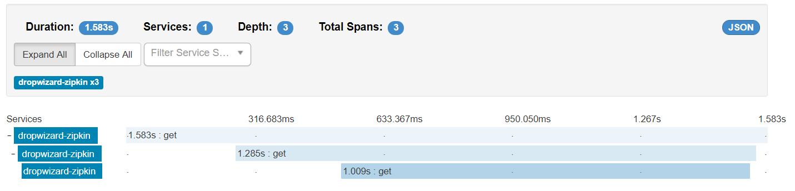

# Dropwizard-Zipkin

## Start DropwizardZipkin Application

1. Run `mvn clean package` to build the application
1. Start zipkin server. We assume the zipkin host is 'http://localhost:9411'
1. Start the first app with `java -jar target/dropwizard-zipkin-1.0-SNAPSHOT.jar server config1.yml`
1. Start the second app with `java -jar target/dropwizard-zipkin-1.0-SNAPSHOT.jar server config2.yml`
1. Enter `http://localhost:8080/query` to produce traces.
1. Enter `http://localhost:9411/query`. Traces are showed here.



## How to Integrate zipkin with Other Dropwizard Application

1. Add dependencies to `pom.xml`

    ```xml
    <dependency>
        <groupId>io.zipkin.brave</groupId>
        <artifactId>brave</artifactId>
        <version>4.9.2</version>
    </dependency>
    <dependency>
        <groupId>com.smoketurner.dropwizard</groupId>
        <artifactId>zipkin-core</artifactId>
        <version>1.2.0-1</version>
    </dependency>
    ```

1. Add `brave.okhttp3.TracingInterceptor` to your `src`

    > `TracingInterceptor` is officially supported in brave-4.9.3. For the moment, we just copy this class to our src and it does work.

1. Add zipkin bundle to `initialize` in `DropwizardZipkinApplication.class`

    ```java
    String serviceName = "DropwizardZipkin";
    bootstrap.addBundle(new ZipkinBundle<DropwizardZipkinConfiguration>(serviceName) {
        @Override
        public ZipkinFactory getZipkinFactory(DropwizardZipkinConfiguration configuration) {
            return configuration.getZipkinFactory();
        }
    });
    ```

1. Add `tracing` and register it in `run` of `DropwizardZipkinApplication.class`

    ```java
    public void run(final DropwizardZipkinConfiguration configuration,
                    final Environment environment) throws IOException {
        final Optional<HttpTracing> tracing = configuration.getZipkinFactory().build(environment);
        if (tracing.isPresent()) {
            final HelloWorldResource resource = new HelloWorldResource(tracing.get());
            environment.jersey().register(resource);
        }
    }
    
    ```
    
1. Add dispatcher and interceptor to OkHttpClient.

    ```java
    client = new OkHttpClient.Builder()
            .dispatcher(new Dispatcher(
                    tracing.tracing().currentTraceContext().executorService(new Dispatcher().executorService())
            ))
            .addNetworkInterceptor(TracingInterceptor.create(tracing))
            .build();
    ```